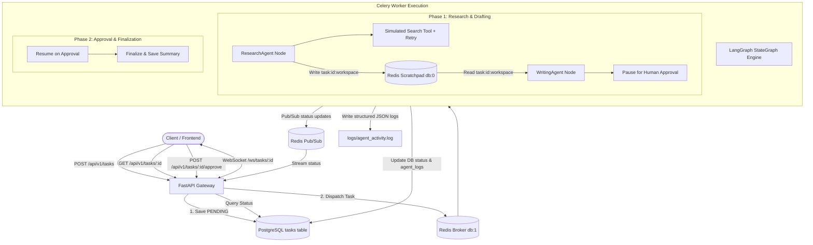

# Collaborative Multi-Agent Orchestration Framework with LangGraph

[](https://www.python.org/)
[](https://fastapi.tiangolo.com/)
[](https://github.com/langchain-ai/langgraph)
[](https://docs.celeryq.dev/)
[](https://docs.docker.com/compose/)

A production-grade, asynchronous multi-agent backend system where specialized AI agents collaborate to solve complex, multi-step tasks. Built with **FastAPI**, **LangGraph**, **PostgreSQL**, **Redis**, and **Celery**, featuring **Human-in-the-Loop (HITL)** approval workflows, **ephemeral scratchpad memory**, **real-time WebSocket streaming**, and **fault-tolerant retry logic**.

---

## 🏛 System Architecture



---

## ✨ Key Features

- **Asynchronous Non-Blocking Execution**: Task submissions return immediately (`202 Accepted` in `<500ms`), offloading heavy LLM and agent execution to Celery background workers.
- **Bifurcated State Management**:
  - **Persistent Storage (PostgreSQL)**: Long-term storage of task records, final results, timestamps, and high-level agent audit trails (`agent_logs` JSONB column).
  - **Ephemeral Scratchpad Memory (Redis)**: Low-latency shared workspace (`task:<task_id>:workspace`) for intermediate agent data transfer without database bloat.
- **LangGraph Multi-Agent Orchestration**: Specialized nodes (`ResearchAgent`, `WritingAgent`, `SupervisorAgent`) executing cyclic and stateful workflows.
- **Human-in-the-Loop (HITL)**: Graph pauses at decision points (`AWAITING_APPROVAL`), safely holds state, and resumes upon human review via the approval endpoint (`POST /approve`).
- **Real-Time Observability via WebSockets**: Live status stream (`RUNNING` ➔ `AWAITING_APPROVAL` ➔ `RESUMED` ➔ `COMPLETED`) broadcast over Redis Pub/Sub to `/ws/tasks/{task_id}`.
- **Fault-Tolerant Retry Logic**: Automatic retry wrappers catch transient tool failures (e.g. `__FLAKY_TEST__`) and recover without terminating the workflow.
- **Structured JSON Activity Logging**: Machine-readable JSON logs appended to `logs/agent_activity.log` detailing every step, failure, and retry.

---

## 📂 Repository Structure

```
.
├── docker-compose.yml       # Service orchestration (API, Worker, DB, Redis)
├── Dockerfile               # Production container image
├── .env.example             # Environment variable template
├── .env                     # Local environment configuration
├── README.md                # Project documentation
├── requirements.txt         # Python dependencies
├── logs/                    # Persisted structured JSON logs
│   └── agent_activity.log
├── src/
│   ├── main.py              # FastAPI application entrypoint & health checks
│   ├── api/                 # API router & WebSocket handlers
│   │   ├── v1/
│   │   │   ├── router.py    # V1 router aggregation
│   │   │   └── tasks.py     # /tasks, /tasks/{id}, /tasks/{id}/approve
│   │   └── websockets.py    # /ws/tasks/{task_id} status streaming
│   ├── agents/              # LangGraph orchestration logic
│   │   ├── state.py         # AgentWorkflowState TypedDict
│   │   ├── tools.py         # Simulated search tool with flaky retry simulation
│   │   ├── research_agent.py# Research node & Redis workspace writer
│   │   ├── writing_agent.py # Writing node & Redis workspace reader
│   │   └── workflow.py      # LangGraph StateGraph definition
│   ├── db/                  # PostgreSQL connection & SQLAlchemy models
│   │   ├── models.py        # Task model (UUID, status, agent_logs JSONB)
│   │   ├── schemas.py       # Pydantic validation schemas
│   │   └── session.py       # Async & Sync database session makers
│   ├── redis_client/        # Redis scratchpad & Pub/Sub publisher
│   │   └── client.py
│   ├── logger/              # Structured JSON file logger
│   │   └── structured_logger.py
│   ├── worker/              # Celery background tasks
│   │   ├── celery_app.py    # Celery configuration
│   │   └── tasks.py         # run_agent_workflow & resume_agent_workflow
│   └── config/              # Configuration loading with Pydantic Settings
│       └── settings.py
└── tests/                   # Automated unit & integration tests
    ├── conftest.py
    ├── test_api.py
    ├── test_agents.py
    ├── test_redis_scratchpad.py
    ├── test_structured_logs.py
    └── test_websocket.py
```

---

## 🚀 Quickstart & Setup

### Prerequisites
- Docker (v24+) & Docker Compose (v2+)
- Python 3.11+ (for local development/testing)

### 1. Clone & Configure Environment

```bash
git clone https://github.com/Shamshuu/Collaborative-AI-Agent-Orchestration-Framework-with-LangGraph
cd Collaborative-AI-Agent-Orchestration-Framework-with-LangGraph

# Create .env from template
cp .env.example .env
```

### 2. Launch All Services

```bash
docker-compose up --build -d
```

All 4 services will automatically start with healthy status checks:
- **FastAPI Server**: `http://localhost:8000`
- **PostgreSQL Database**: `localhost:5432` (`agent_db`)
- **Redis Cache & Broker**: `localhost:6379`
- **Celery Worker**: Background task executor

Check container health:
```bash
docker-compose ps
```

---

## 📡 API Reference & Usage

### 1. Health Check
```bash
curl -X GET http://localhost:8000/health
```
**Response (200 OK):**
```json
{
  "status": "healthy",
  "database": "connected",
  "redis": "connected"
}
```

### 2. Create Task (Asynchronous Dispatch)
```bash
curl -X POST http://localhost:8000/api/v1/tasks \
  -H "Content-Type: application/json" \
  -d '{
    "prompt": "Research the key features of LangGraph and CrewAI. Write a short comparison summary for a technical audience."
  }'
```
**Response (202 Accepted):**
```json
{
  "task_id": "a1b2c3d4-e5f6-7a8b-9c0d-1e2f3a4b5c6d",
  "status": "PENDING"
}
```

### 3. Connect to Real-time WebSocket
```bash
# Using websockets or wscat
wscat -c ws://localhost:8000/ws/tasks/a1b2c3d4-e5f6-7a8b-9c0d-1e2f3a4b5c6d
```
**Streamed Messages:**
```json
{"task_id": "a1b2c3d4-e5f6-7a8b-9c0d-1e2f3a4b5c6d", "status": "RUNNING"}
{"task_id": "a1b2c3d4-e5f6-7a8b-9c0d-1e2f3a4b5c6d", "status": "AWAITING_APPROVAL"}
{"task_id": "a1b2c3d4-e5f6-7a8b-9c0d-1e2f3a4b5c6d", "status": "RESUMED"}
{"task_id": "a1b2c3d4-e5f6-7a8b-9c0d-1e2f3a4b5c6d", "status": "COMPLETED"}
```

### 4. Query Task Details & Status
```bash
curl -X GET http://localhost:8000/api/v1/tasks/a1b2c3d4-e5f6-7a8b-9c0d-1e2f3a4b5c6d
```
**Response (200 OK - While Awaiting Approval):**
```json
{
  "id": "a1b2c3d4-e5f6-7a8b-9c0d-1e2f3a4b5c6d",
  "prompt": "Research the key features of LangGraph and CrewAI...",
  "status": "AWAITING_APPROVAL",
  "result": "## Technical Comparison Summary: LangGraph vs CrewAI...",
  "agent_logs": [
    {
      "agent": "ResearchAgent",
      "action": "Searching for Research the key features...",
      "timestamp": "2026-08-16T12:00:05.123Z"
    },
    {
      "agent": "WritingAgent",
      "action": "Drafting comparison summary",
      "timestamp": "2026-08-16T12:00:07.456Z"
    }
  ],
  "created_at": "2026-08-16T12:00:00.000Z",
  "updated_at": "2026-08-16T12:00:07.456Z"
}
```

### 5. Provide Human Approval
```bash
curl -X POST http://localhost:8000/api/v1/tasks/a1b2c3d4-e5f6-7a8b-9c0d-1e2f3a4b5c6d/approve \
  -H "Content-Type: application/json" \
  -d '{
    "approved": true,
    "feedback": "Looks great! Include key recommendations."
  }'
```
**Response (200 OK):**
```json
{
  "task_id": "a1b2c3d4-e5f6-7a8b-9c0d-1e2f3a4b5c6d",
  "status": "RESUMED"
}
```

---

## 🔬 State Verification & Fault Tolerance

### Redis Shared Scratchpad Inspection
While the task is running or paused in `AWAITING_APPROVAL`, verify the ephemeral scratchpad:
```bash
docker exec -it langgraph_redis redis-cli get "task:<TASK_ID>:workspace"
```

### Flaky Tool Retry Verification
Submit a task with `__FLAKY_TEST__` in the prompt:
```bash
curl -X POST http://localhost:8000/api/v1/tasks \
  -H "Content-Type: application/json" \
  -d '{"prompt": "Investigate __FLAKY_TEST__ resilience"}'
```
Inspect `logs/agent_activity.log` to see the automated failure catch and retry:
```json
{"timestamp": "2026-08-16T12:05:01.100Z", "task_id": "...", "agent_name": "ResearchAgent", "action_details": "Starting web search for 'Investigate __FLAKY_TEST__ resilience'"}
{"timestamp": "2026-08-16T12:05:01.102Z", "task_id": "...", "agent_name": "ResearchAgent", "action_details": "Tool execution failed on attempt 1: Simulated transient network timeout.. Retrying..."}
{"timestamp": "2026-08-16T12:05:01.205Z", "task_id": "...", "agent_name": "ResearchAgent", "action_details": "Tool execution succeeded on retry attempt 2."}
```

---

## 🧪 Automated Testing

Run the full pytest suite locally:
```bash
pytest -v tests/
```

---